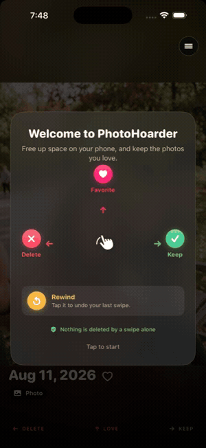
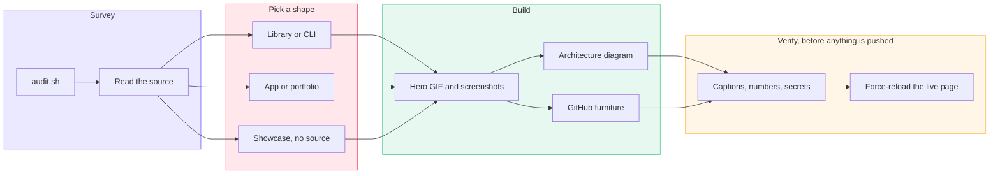

<h1 align="center">GitPretty</h1>

<p align="center"><i>A Claude Code skill that makes a git repo look like someone is proud of it.</i></p>

<p align="center">
  Built by <a href="https://github.com/LauraMoney42"><b>Laura Money</b></a>
</p>

<p align="center">
  
  
  
  
  <a href="LICENSE"></a>
</p>

---

<p align="center">
  
</p>

<p align="center">
  <a href="https://github.com/LauraMoney42/PhotoHoarder-public"><b>See a finished example: PhotoHoarder-public</b></a><br>
  <sub>Those five screens are the screenshot set from a real repo built this way.</sub>
</p>

---

## The problem

Good code sits in bare repos. No description, no README past the title, no
screenshot, no license. The work is real and the page says nothing, so anyone who
lands there closes the tab.

Writing a good README is not hard, but it is fiddly and easy to get subtly
wrong, and the mistakes are invisible to the person who made them. A caption on
the wrong screenshot. A number copied from a doc that went stale five months ago.
A mermaid diagram that renders locally and breaks on GitHub. An install command
that fails on line one.

## What it does

Point it at a repo and it does the whole job: picks the right README shape,
writes it from the source rather than from stale docs, builds a hero GIF or
screenshot set, draws an architecture diagram, and fills in the GitHub furniture.

A repo is read in a fixed order, and the skill works down it:

1. **The GitHub card** (name, description, topics), which is all a search result
   shows
2. **The hero**, the first image before any scrolling
3. **The first screen of README**: what it is, whether it works, how to start
4. **One prose section, read closely**, usually architecture

## Four repo shapes, four README orders

The section order is not universal. It depends on why someone landed on the repo,
and getting it backwards is the most common way a decent README still fails.

| Reader arrives wanting to... | Shape | Key rule |
|---|---|---|
| Install and use it | Library, package, CLI, MCP server | Install command **above the fold** |
| Run it, or see what it does | App or tool, source visible | Hero image near the top |
| Judge whether you can build | Personal or portfolio project | "The hard part" is the main event |
| Believe an app is real without seeing code | Private app, public landing page | Proof first, engineering second |

A hero GIF that pushes `pip install thing` below the fold costs adoption, because
that reader came to try it. A library README that opens with three paragraphs of
philosophy loses to the one that opens with a command. Same craft, opposite
order.

## How it works

The same kind of diagram the skill writes into your repo, drawn for itself.



| Stage | What happens |
|---|---|
| `audit.sh` | Read-only survey of what every repo is missing. You pick the targets |
| Read the source | Entry point, constants, tests, and comments. Never the stale docs |
| Pick a shape | Four README orders, chosen by why a reader arrives |
| Hero GIF and screenshots | ffmpeg recipes, then a contact sheet so no caption lands on the wrong file |
| Architecture diagram | Mermaid, a component table, and decisions with what broke when you tried the obvious thing |
| GitHub furniture | Description, topics, license, social preview, releases |
| Captions, numbers, secrets | Every claim checked against source, every secret grepped for |
| Force-reload the live page | Mermaid breaks only on GitHub, and GitHub caches the broken version |

Node labels stay plain and the descriptions live in the table, because `<br/>`
inside a mermaid node renders as run-together text on GitHub. The skill enforces
that rule on your diagrams; this one follows it too.

## Audit mode

Before touching anything, survey what is actually missing:

```bash
~/.claude/skills/gitpretty/scripts/audit.sh --public-only
```

```
REPO                         VIS      DESC     TOPICS   LICENSE  README
--------------------------------------------------------------------------
GitPretty                    PUBLIC   ok       3        none     ok 5897b
WidgetLife                   PUBLIC   none     none     none     none
Medusa                       PUBLIC   ok       none     mit      ok 5815b
```

Read-only. It never writes, pushes, or edits, so you pick the targets. Works on
GitHub repos (`gh`) or on a folder of local clones (`--local`).

## What is in here

| File | What it holds |
|---|---|
| `SKILL.md` | The workflow, mode and shape selection, mermaid gotchas, ship checklist |
| `references/readme-library.md` | README shape for anything installable |
| `references/readme-app.md` | README shape for an app or tool, plus the portfolio variant |
| `references/readme-showcase.md` | README shape for a private app's public page, plus the permission gate |
| `references/repo-polish.md` | Everything outside the README: description, topics, license, social preview, releases |
| `references/media.md` | Every ffmpeg and sips command, with the failure modes that make them necessary |
| `scripts/audit.sh` | The read-only survey above |

## The gotchas it encodes

This started as notes taken while building a showcase repo by hand. Everything
below actually went wrong, which is why the skill exists rather than a prompt
saying "write a nice README":

- **Timestamped filenames lie.** `Simulator Screenshot - ... 16.48.50.png` tells
  you nothing, and two adjacent captures are often the same screen at different
  scroll positions. Contact sheet the final set before writing captions. A
  caption on the wrong screenshot is the kind of error a reviewer catches and you
  never do
- **Docs go stale, code does not.** In one pass, an architecture doc was five
  months behind on a retention window: it said 24 hours, `Constants.swift` said
  35 days. Every number on the page gets verified against source
- **A quickstart that fails on line one** is the most common defect in library
  READMEs. Run it and paste the real output
- **A relative `.mp4` in a GitHub README does not produce a player.** The GIF is
  the visible hero; the mp4 is a link underneath
- **Mermaid breaks only on GitHub.** `<br/>` in node labels runs text together,
  `direction LR` inside a subgraph is ignored when the subgraph has external
  edges, and a single-node subgraph bends the layout into a staircase. All three
  render fine locally
- **GitHub caches rendered diagrams.** Force-reload before concluding your fix
  did not work
- **A public repo with no LICENSE is all rights reserved**, which means nobody
  may legally use it, and a company's legal review stops at the missing file
- **Feeding a glob of stills straight into `paletteuse` fails** on ffmpeg 8.x
  with "Internal bug, should not have happened." Route through an intermediate
  mp4

## Install

```bash
git clone https://github.com/LauraMoney42/GitPretty.git ~/.claude/skills/gitpretty
```

Then start a new Claude Code session and say what you want:

```
prettify the repo in ~/Documents/GIT/MyApp
```

It triggers on its own for bare repos, missing READMEs, demo GIFs, architecture
diagrams, portfolio and showcase repos, and "clean up my GitHub." You can also
invoke it by name with `/gitpretty`.

Needs [`ffmpeg`](https://ffmpeg.org) for media and [`gh`](https://cli.github.com)
for GitHub metadata. `sips` ships with macOS.

## License

MIT. See [LICENSE](LICENSE). Use it, fork it, change it.

## About

Built by Laura Money, starting from notes taken while shipping
[PhotoHoarder-public](https://github.com/LauraMoney42/PhotoHoarder-public), then
generalized to any repo.

The screens in the demo above are that repo's screenshot set, run back through
the skill's own slideshow recipe.
